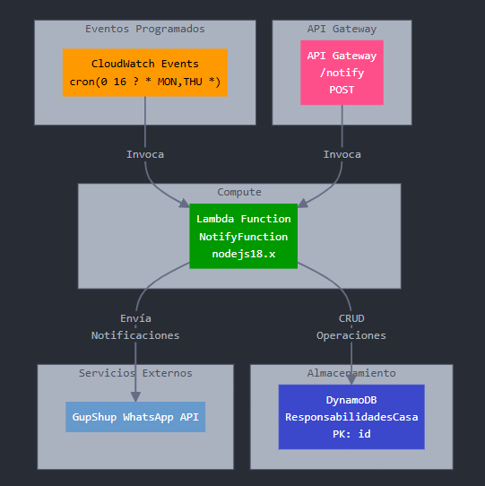

# Aplicación de Gestión de Responsabilidades del Hogar

Este proyecto implementa una solución serverless para gestionar y notificar automáticamente responsabilidades entre los integrantes de una casa a través de WhatsApp.

## 📋 Descripción

La aplicación permite asignar responsabilidades de manera rotativa entre los integrantes de la casa y envía notificaciones automáticas por WhatsApp cuando es el turno de cada persona. Todo funciona sin servidores que mantener, utilizando servicios AWS y la API de GupShup para mensajería.

## 🏗️ Arquitectura



La solución utiliza los siguientes servicios:

- **AWS Lambda**: Función que contiene la lógica de negocio
- **Amazon DynamoDB**: Almacena la información de responsabilidades y responsables
- **Amazon API Gateway**: Expone un endpoint para invocar la función manualmente
- **CloudWatch Events**: Programa la ejecución automática (lunes y jueves a las 4pm)
- **GupShup API**: Servicio externo para enviar mensajes por WhatsApp

## 🚀 Despliegue

Para desplegar la aplicación:

```bash
# Empaquetar la aplicación
sam build

# Desplegar en AWS
sam deploy --guided
```

Durante el despliegue guiado, proporciona los siguientes parámetros:

- Stack Name: `responsabilidades-casa`
- AWS Region: `tu-región-preferida`
- Confirm changes before deploy: `Y`
- Allow SAM CLI IAM role creation: `Y`

## 📊 Estructura de Datos

### Tabla DynamoDB: ResponsabilidadesCasa

Ejemplo de un ítem en la tabla:

```json
{
  "id": "lavar-platos",
  "descripcion": "Lavar los platos después de cada comida",
  "responsables": [
    {
      "id": "1",
      "nombre": "Juan",
      "telefono": "573211234567"
    },
    {
      "id": "2",
      "nombre": "María",
      "telefono": "573219876543"
    }
  ],
  "ultimoResponsable": "1"
}
```

## 📝 Funcionalidad

La aplicación ofrece:

1. **Rotación automática**: Asigna responsabilidades rotando entre los miembros registrados
2. **Notificaciones**: Envía mensajes de WhatsApp a la persona que debe realizar la tarea
3. **Programación**: Se ejecuta automáticamente los lunes y jueves
4. **API**: Permite invocar la asignación manualmente vía API REST

## 🔧 Uso

### Invocar manualmente

```bash
# Usando curl
curl -X POST \
  https://tu-api-gateway-url/Prod/notify \
  -H 'Content-Type: application/json' \
  -d '{"idResponsability": "lavar-platos"}'
```

### Respuesta de ejemplo

```json
{
  "message": "WhatsApp enviado a María",
  "response": {
    "status": "submitted",
    "messageId": "1234567890abcdef"
  }
}
```

## ⚙️ Variables de Entorno

La función Lambda utiliza las siguientes variables de entorno:

| Variable         | Descripción                        |
| ---------------- | ---------------------------------- |
| TABLE_NAME       | Nombre de la tabla DynamoDB        |
| GUPSHUP_URL      | URL de la API de GupShup           |
| API_KEY          | Clave API para GupShup             |
| GUPSHUP_SENDER   | Número de WhatsApp remitente       |
| GUPSHUP_APP_NAME | Nombre de la aplicación en GupShup |

## 🔍 Monitoreo

Para monitorear la aplicación:

1. Abre la consola de AWS Lambda
2. Navega a la función `NotifyFunction`
3. Revisa los logs en CloudWatch Logs

## 🧪 Probar Localmente

```bash
# Invocar localmente con evento de ejemplo
sam local invoke NotifyFunction --event events/api-event.json

# Iniciar API localmente
sam local start-api
```

## 📈 Mejoras Futuras

- Interfaz de usuario para gestionar responsabilidades
- Soporte para confirmación de tareas completadas
- Recordatorios adicionales si la tarea no se completa
- Estadísticas de cumplimiento por persona

## 📄 Licencia

Este proyecto está licenciado bajo MIT License.
